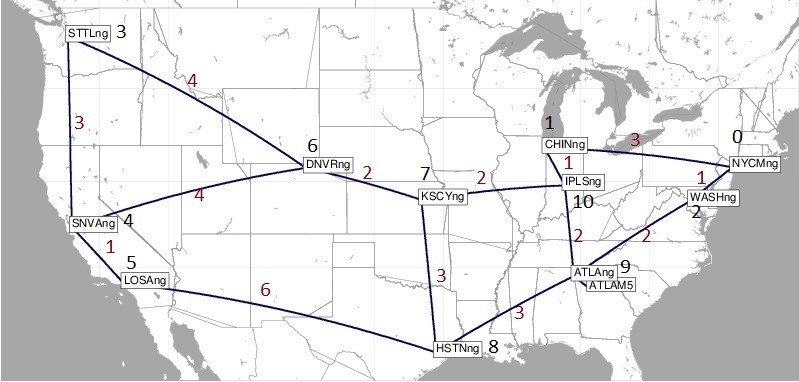

# placement-emulation
Automatically emulate network service placements calculated by placement algorithms

Folder structure:

* `emulator`: `topology_zoo.py` script, reading a Topology Zoo network and starting it in `vim-emu` 
* `placement`: `placement_emulator.py` triggers the `bjointsp` placement algorithm and starts the placed VNFs on the emulator
* `util`: auxiliary scripts for measurement
* `inputs`: example VNF images, networks, services, sources for placement and emulation
* `results`: placement results and emulation logs
* `docs`: docs...


## Preliminary timeplan

* until 13.4.: first complete paper draft
* until 27.4.: complete paper
* until 4.5.: finalization
* **deadline (probably!): 12.5.**


## Installation

1. Install the emulator:
   1. Install [`vim-emu`](https://osm.etsi.org/gitweb/?p=osm/vim-emu.git) (see [README.md "Bare-metal installation"](https://osm.etsi.org/gitweb/?p=osm/vim-emu.git;a=blob;f=README.md;h=ba22ec342ed5d60bf65770aa154adce8b0fcc141;hb=HEAD))
      - `cd vim-emu; sudo python setup.py develop`
      - *Note: I use a workaround inside the emulator to compute shortest paths correctly using link delays (instead of hop count). This workaround is currently only at my private repository: https://github.com/StefanUPB/vim-emu*
   2. Pre-build VNF containers: `cd inputs/vnfs; ./build.sh`
   3. Install some other dependencies: `geopy`, `numpy`, `requests`
2. Install [`bjointsp 2.3+`](https://github.com/CN-UPB/B-JointSP/tree/placement-emulation) (use `setup.py` in the `placement-emulation` branch)
   - `sudo pyhton3 setup.py develop` Somehow `install` doesn't work at the moment.
   - Requires Python 3.5

## Usage

**Quickstart:**

To start the emulator, calculate the placement, emulate it, measure and log delays, and stop the emulator with one command, use:

```
./place-emu.sh -a algorithm -n network -t service -s sources -c num_pings
```

Where `algorithm` is a placement algorithm, e.g., `bjointsp`, `random`, or `greedy`. Inputs `network`, `service`, and `sources` are paths to input parameters, e.g., from the `inputs`. `num_pings` is the number of packets sent by each delay measurement, e.g., 5 for testing and 100 for evaluation.
If you just want to test placement-emulation with predefined parameters, simply run `test.sh`.


**Separate steps:**

If you prefer to run the steps yourself, you can follow these manual steps:

1. Select inputs from `inputs`
2. Start the topology on `vim-emu` as described [below](#start-a-topology), e.g., `sudo python emulator/topology_zoo.py -g inputs/networks/Abilene.graphml`
3. Start the placement and emulation with `python3 placement/placement_emulator.py -a bjointsp --network inputs/networks/Abilene.graphml --service inputs/services/fw1chain.yaml --sources inputs/sources/source0.yaml`.
4. You can test the deployment and connectivity as described [below](#testing-the-deployment), e.g., with `vim-emu compute list`. Delay measurements can be performed with `ping` or `httping` from inside `vim-emu`.
5. Important: Stop the emulator using `exit` inside the ContainerNet terminal. This is necessary to clean up, so that the emulator can be started again.

*Note*:
The `-a` argument sets the placement algorithm: Currently, we support `bjointsp`, `random`, and `greedy`.
If you only want to trigger placement without emulation, use the `--placeOnly` option when calling `placement_emulator.py`.


**Experiments:**

Use scripts like `runAllAbilene.sh` to run a large number of placement emulations sequentially. *Important:* use `|& tee some_log.log` to log the display output for debugging.


## Emulation environment

### Start a topology

1. `sudo python emulator/topology_zoo.py -g inputs/networks/Abilene.graphml`
2. Check if everything is working (other terminal): `vim-emu datacenter list`

### Start and place a service (example)

*Note: This section may be outdated! E.g., the proxy is no longer used due to weird timing effects.* 

#### Used service

The used service has four containers:
`User -> Proxy (Squid) -> L4FW (Socat) -> Webservice (Apache)`

```
     Example Service Chain an IPs

       +-------+        +------+
       |       |        |      |
       |  User |        | Web  |
       |       |        |      |
       +-------+        +---^--+
10.0.0.1/24|                | 30.0.0.2/24
           |                |
10.0.0.2/24|                | 30.0.0.1/24
       +---v---+        +---+--+
       |       |        |      |
       | Proxy +--------> L4FW |
       |       |        |      |
       +-------+        +------+
         20.0.0.1/24  20.0.0.2/24


```

#### Deployment steps

```bash
# deploy VNFs
vim-emu compute start -n vnf_user -i placement-user-img --net '(id=output,ip=10.0.0.1/24)' -d pop0
vim-emu compute start -n vnf_proxy -i placement-squid-img --net '(id=input,ip=10.0.0.2/24),(id=output,ip=20.0.0.1/24)' -d pop1
vim-emu compute start -n vnf_l4fw -i placement-socat-img --net '(id=input,ip=20.0.0.2/24),(id=output,ip=30.0.0.1/24)' -d pop2
vim-emu compute start -n vnf_web -i placement-apache-img --net '(id=input,ip=30.0.0.2/24)' -d pop3

# setup network forwarding rules
vim-emu network add -src vnf_user:output -dst vnf_proxy:input
vim-emu network add -src vnf_proxy:output -dst vnf_l4fw:input
vim-emu network add -src vnf_l4fw:output -dst vnf_web:input
```
(this script is also available in `emulator/deploy_example.sh`)

#### Testing the deployment

```bash
# check deployment
vim-emu compute list
+--------------+-------------+----------------------+------------------+-------------------------+
| Datacenter   | Container   | Image                | Interface list   | Datacenter interfaces   |
+==============+=============+======================+==================+=========================+
| pop3         | vnf_web     | placement-apache-img | input            | dc4.s1-eth3             |
+--------------+-------------+----------------------+------------------+-------------------------+
| pop2         | vnf_l4fw    | placement-socat-img  | input,output     | dc3.s1-eth3,dc3.s1-eth4 |
+--------------+-------------+----------------------+------------------+-------------------------+
| pop1         | vnf_proxy   | placement-squid-img  | input,output     | dc2.s1-eth3,dc2.s1-eth4 |
+--------------+-------------+----------------------+------------------+-------------------------+
| pop0         | vnf_user    | placement-user-img   | output           | dc1.s1-eth3             |
+--------------+-------------+----------------------+------------------+-------------------------+

# check basic connectivity
containernet> vnf_user ping -c3 10.0.0.2
containernet> vnf_proxy ping -c3 20.0.0.2
containernet> vnf_l4fw ping -c3 30.0.0.2

# full chain HTTP connectivity
containernet> vnf_user curl -x http://10.0.0.2:3128 http://20.0.0.2:8899
```

This `curl` command might look confusing. It does the following:

* a HTTP request to the IP of `vnf_l4fw` that forwards the request arriving at port `TCP:8899` to `vnf_web` on port `TCP:80`
* for the request it has to use the proxy (`vnf_proxy`) which is specified by `-x http://10.0.0.2:3128`

#### Manual RTT measurement

(in a new terminal)
```bash
# log into to vnf_user
docker exec -it mn.vnf_user /bin/bash

# basic check
vnf_user curl -x http://10.0.0.2:3128 http://20.0.0.2:8899 -v

# use httping to measure RTT between user and vnf_web
vnf_user httping --proxy 10.0.0.2:3128 --url http://20.0.0.2 -p 8899 -c 5
```

#### Shut down experiment

```bash
containernet> exit
```

### Notes

* Each node of the given graph is turned into an emulated datacenter (PoP)
* PoPs are named based on the node IDs of the networkx graph (not their labels): `pop<ID>` e.g. `pop42`
* Link latencies are calculated based on node's geo. locations
* Link bandwidth is set if given in the graph (not many topologies have it)


## Example input
### Abilene network
The figure below visualizes the Abilene network (from SNDlib). Our topology (from Topology Zoo) only has 11 nodes, missing the "ATLAM5" node.

The black numbers illustrate the pop number used by the `vim-emu` and the placement algorithm. The dark red numbers indicate the rounded link delay between the pops (as used here). This is supposed to support and simplify the analysis of delay measurements.




### Network service chains
The repository ~~also~~ only contains examples without the proxy, which may introduce unexpected effects. These examples contain 1-2 L4FW or 1-2 bridges instead. While L4FW each require a separate TCP connection, leading to higher delays with `httping`, the bridges don't such that there's only one TCP connection from the user to the web server.

We use chains of varying length, in which a user (1st "VNF") requests content from a web server (last VNF). In between, there are 1 to 3 forwarding VNFs (either layer 2 or layer 4).

#### Chains with layer-4 forwarders (socat)
L4FW are connected with separate TCP connections. Each TCP connection is setup using TCP's 3-way handshake, leading to considerable delay. These are the different chains (interfaces in brackets):

```
vnf_user (88.0.0.1/24) --> (88.0.0.2/24) vnf_fw1 (99.0.0.1/24) --> (99.0.0.2/24) vnf_web
```

```
vnf_user (77.0.0.1/24) --> (77.0.0.2/24) vnf_fw2 (88.0.0.1/24) --> (88.0.0.2/24) vnf_fw1 (99.0.0.1/24) --> (99.0.0.2/24) vnf_web
```

```
vnf_user (66.0.0.1/24) --> (66.0.0.2/24) vnf_fw3 (77.0.0.1/24) --> (77.0.0.2/24) vnf_fw2 (88.0.0.1/24) --> (88.0.0.2/24) vnf_fw1 (99.0.0.1/24) --> (99.0.0.2/24) vnf_web
```

#### Chains with layer-2 forwarders (bridges)
Here, user and web server are directly connected with a single TCP connection, thus requiring shorter setup delay.

```
vnf_user (88.0.0.1/24) --> (88.0.0.2/24) vnf_bridge1 (88.0.0.3/24) --> (88.0.0.4/24) vnf_web
```

```
vnf_user (88.0.0.1/24) --> (88.0.0.2/24) vnf_bridge2 (88.0.0.3/24) --> (88.0.0.4/24) vnf_bridge1 (88.0.0.5/24) --> (88.0.0.6/24) vnf_web
```

```
vnf_user (88.0.0.1/24) --> (88.0.0.2/24) vnf_bridge3 (88.0.0.3/24) --> (88.0.0.4/24) vnf_bridge2 (88.0.0.5/24) --> (88.0.0.6/24) vnf_bridge1 (88.0.0.7/24) --> (88.0.0.8/24) vnf_web
```

# Current limitations

* No proper REST API
* Only linear chains
* Only routing along shortest paths regarding delay
* Only one source and one service (otherwise, make sure to manually adjust IPs of VNFs and vLinks!)
* No scaling
